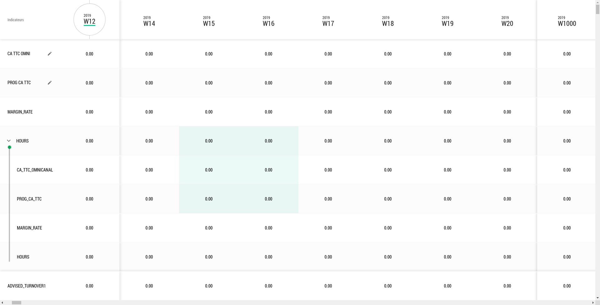
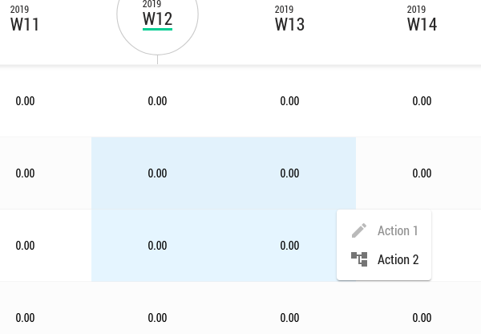

# @decathlon/react-table

React components for efficiently rendering large tabular data



*A table with 15 000 rows and 1 000 columns (with sub rows, fixed rows and fixed columns)*




*A table with custom right click menu*


### Installing

```
npm install -S @decathlon/react-table
```

### Usage


```js
import Table from "@decathlon/react-table";
import "@decathlon/react-table/dist/style/index.css";

 const rows = [
    {
      id: "header",
      isHeader: true,
      cells: [
        {
          id: "wawoo",
          value: "Wawooo!"
        },
        ...
      ]
    },
    {
      id: "row1",
      cells: [
        {
          id: "react",
          value: "React"
        },
        ...
      ]
    },
    ...
   ];

function MyComponent() {
  return (
    <Table
      id="table-id"
      rows={rows}
      columns={{ 0: { style: { justifyContent: "left" }, size: 200 } }}
      isVirtualized
      virtualizerProps={{
        fixedRows: [0],
        fixedColumns: [0],
        height: 500,
        width: 1000
      }}
    />
  );
}
```

## Getting Started (Devs)

```bash
git clone ...
cd @decathlon/react-table
npm ci
npm run storybook
```

🚀 Storybook ready at  http://localhost:9001/

## Running the tests

```
npm run test
npm run lint
```
## Contributing

**PRs are welcome!**
You noticed a bug, a possible improvement or whatever?
Any help is always appreciated, so don't hesitate opening one!

Be sure to check out the [contributing guidelines](CONTRIBUTING.md) to fasten
up the merging process.

## Active authors

* **Amen Souissi**  [amen-souissi](https://github.com/amen-souissi)
* **Hyacinthe Knobloch** [hyacintheknobloch](https://github.com/hyacintheknobloch)
* **Benjamin Wintrebert** [Ben-Wintrebert](https://github.com/Ben-Wintrebert)

See also the list of [contributors](https://github.com/Decathlon/react-table/graphs/contributors) who participated in this project.

## License

This project is licensed under the Apache-2.0 License - see the [LICENSE.md](https://github.com/Decathlon/react-table/blob/master/LICENSE) file for details
